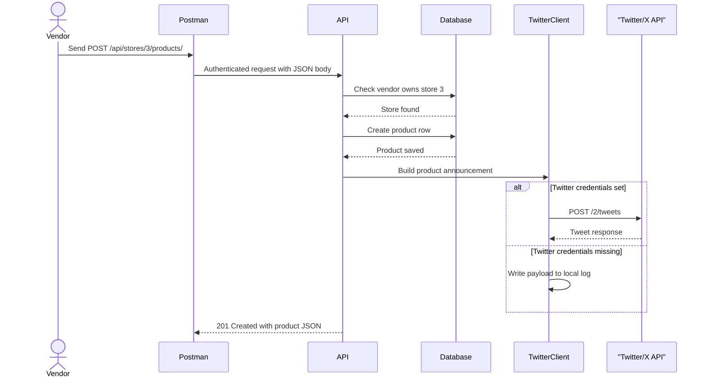

# API Sequence Diagram

```mermaid
sequenceDiagram
    actor Vendor
    participant Postman
    participant API
    participant Database
    participant TwitterClient
    participant XAPI as "Twitter/X API"

    Vendor->>Postman: Send POST /api/stores/3/products/
    Postman->>API: Authenticated request with JSON body
    API->>Database: Check vendor owns store 3
    Database-->>API: Store found
    API->>Database: Create product row
    Database-->>API: Product saved
    API->>TwitterClient: Build product announcement

    alt Twitter credentials set
        TwitterClient->>XAPI: POST /2/tweets
        XAPI-->>TwitterClient: Tweet response
    else Twitter credentials missing
        TwitterClient->>TwitterClient: Write payload to local log
    end

    API-->>Postman: 201 Created with product JSON
```
