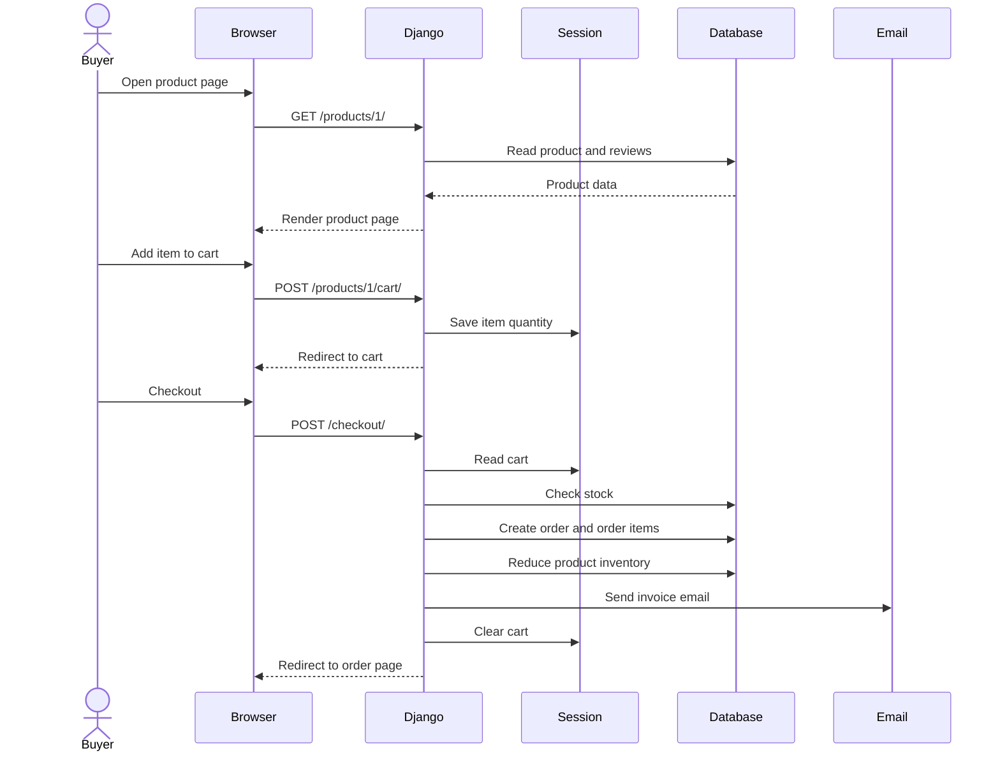

# System Sequence Diagram

```mermaid
sequenceDiagram
    actor Buyer
    participant Browser
    participant Django
    participant Session
    participant Database
    participant Email

    Buyer->>Browser: Open product page
    Browser->>Django: GET /products/1/
    Django->>Database: Read product and reviews
    Database-->>Django: Product data
    Django-->>Browser: Render product page

    Buyer->>Browser: Add item to cart
    Browser->>Django: POST /products/1/cart/
    Django->>Session: Save item quantity
    Django-->>Browser: Redirect to cart

    Buyer->>Browser: Checkout
    Browser->>Django: POST /checkout/
    Django->>Session: Read cart
    Django->>Database: Check stock
    Django->>Database: Create order and order items
    Django->>Database: Reduce product inventory
    Django->>Email: Send invoice email
    Django->>Session: Clear cart
    Django-->>Browser: Redirect to order page
```
